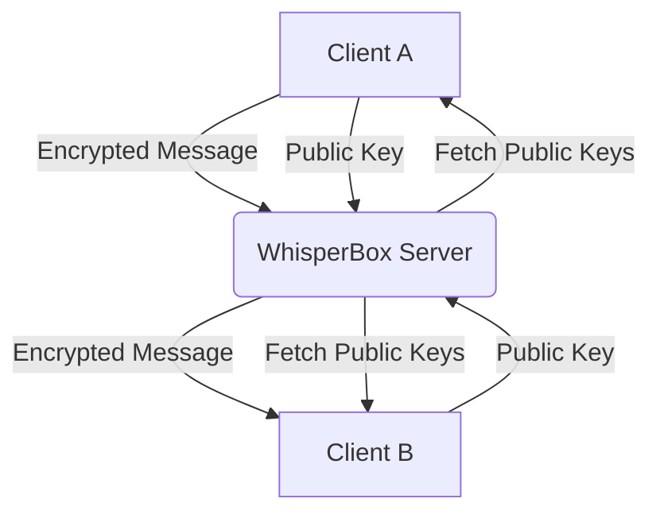

# 🔒 WhisperBox — End-to-End Encrypted Messaging

WhisperBox is a secure messaging application that implements industry-standard End-to-End Encryption (E2EE). It ensures that your messages are encrypted before they leave your device and can only be decrypted by the intended recipient. The server acts only as a secure relay and never sees your plaintext data.

## 🏗️ Architecture

The application follows a client-heavy security model where all cryptographic operations are performed in the browser using the **Web Crypto API**.

## 🔐 Encryption Flow

WhisperBox uses a **Hybrid Encryption Scheme** to combine the strength of RSA with the performance of AES.

### Sending a Message
1. **Symmetric Key Generation**: A temporary 256-bit AES-GCM key is generated for every message.
2. **Payload Encryption**: The message plaintext is encrypted using the AES key.
3. **Key Exchange (Dual Encryption)**: 
    - The AES key is encrypted with the **Recipient's RSA-OAEP Public Key**.
    - The AES key is also encrypted with the **Sender's RSA-OAEP Public Key** (allowing the sender to read their own history).
4. **Transmission**: The server receives only the ciphertext, IV, and the two encrypted versions of the AES key.

### Receiving a Message
1. **Key Recovery**: The recipient retrieves their **RSA Private Key** from secure storage.
2. **Symmetric Key Decryption**: The encrypted AES key is decrypted using the recipient's Private Key.
3. **Plaintext Recovery**: The original message is decrypted using the recovered AES key and the IV.

## 🔑 Key Management

### Registration & Login
- **RSA Keypair**: Generated locally upon registration.
- **Private Key Protection**: The private key never leaves the client in plaintext. It is "wrapped" (encrypted) using an **AES-GCM key derived from the user's password** via PBKDF2 (100,000 iterations).
- **Session Storage**: Once unwrapped, the private key is stored in **IndexedDB** (`idb-keyval`) for the duration of the session, ensuring it survives page refreshes but remains inaccessible to other sites.

## 🛡️ Security Trade-offs & Decisions

| Decision | Trade-off | Rationale |
| :--- | :--- | :--- |
| **AES-GCM for Wrapping** | Compatibility | Switched from AES-KW to AES-GCM for wrapping RSA keys because standard AES-KW requires 8-byte alignment which RSA PKCS#8 exports do not consistently provide in all browsers. |
| **IndexedDB Storage** | Persistent Session | Storing the unwrapped key in IndexedDB improves UX by not requiring a password for every message, but assumes the device itself is not compromised. |
| **PBKDF2 Iterations** | Performance vs Security | Used 100,000 iterations. While lower than some modern standards (e.g., 600,000), it provides a balance between brute-force protection and acceptable login time on mobile devices. |

## ⚠️ Known Limitations
- **Forward Secrecy**: This version uses static RSA keys. A compromise of the long-term private key could theoretically decrypt past messages. (Future improvement: Diffie-Hellman ephemeral keys).
- **Metadata**: While message content is encrypted, the server still knows who is talking to whom and when (Traffic Analysis).
- **Group Chats**: Currently optimized for 1-on-1 messaging.

## 🚀 Getting Started

1. `npm install`
2. `npm run dev`
3. Register two accounts and start a secure conversation!
